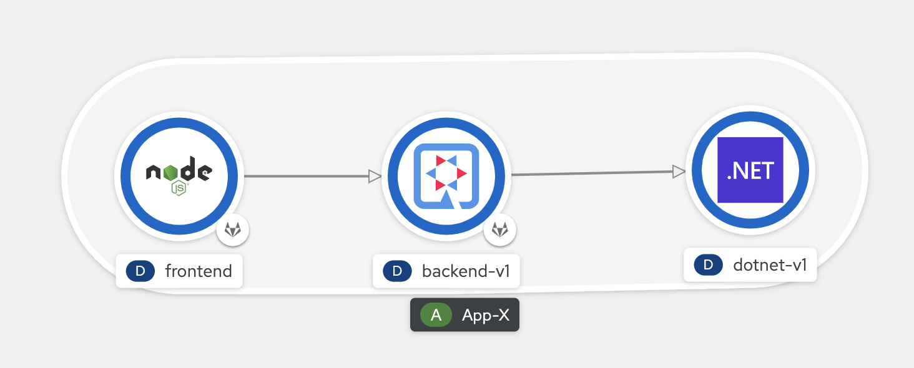
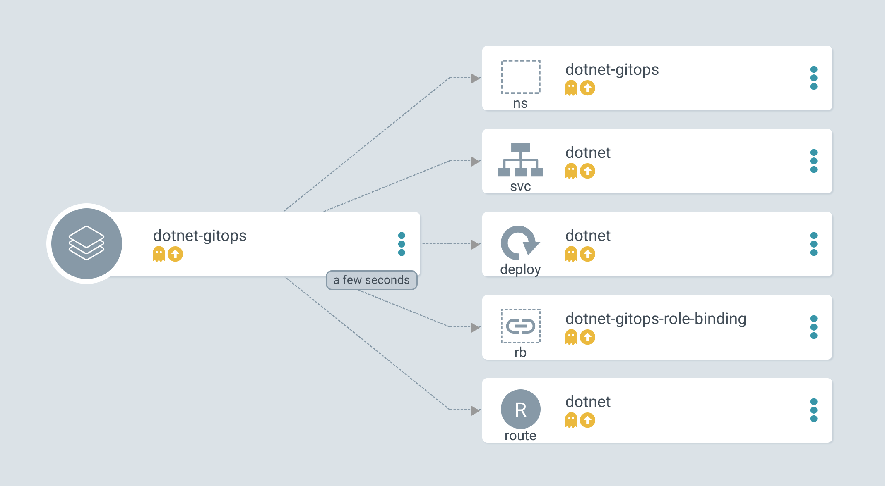

# .NET for Cloud-Native
<!-- TOC -->

- [.NET for Cloud-Native](#net-for-cloud-native)
  - [Prerequisites](#prerequisites)
  - [Deploy .NET Core from Developer Console with S2I](#deploy-net-core-from-developer-console-with-s2i)
  - [Deploy .NET Core from Dockerfile with S2I](#deploy-net-core-from-dockerfile-with-s2i)
  - [Deploy .NET Core from oc command with S2I](#deploy-net-core-from-oc-command-with-s2i)
  - [.NET User Workload Monitoring](#net-user-workload-monitoring)
  - [.NET with Openshift Pipeline (Tekton)](#net-with-openshift-pipeline-tekton)
  - [.NET with OpenShift Service Mesh](#net-with-openshift-service-mesh)
  - [.NET with OpenShift Serverless](#net-with-openshift-serverless)
  - [.NET with OpenShift GitOps](#net-with-openshift-gitops)

<!-- /TOC -->
## Prerequisites

- check .net core ready to use
    ```sh
    oc project openshift 
    oc describe is dotnet
    ```

- install dotnet core imagestreams
    ```sh
    $ oc project openshift
    $ oc create -f https://raw.githubusercontent.com/redhat-developer/s2i-dotnetcore/master/dotnet_imagestreams.json

    #or 

    $ oc replace -f https://raw.githubusercontent.com/redhat-developer/s2i-dotnetcore/master/dotnet_imagestreams.json
    ```

- install OpenShift Serverless (create knative service in project knative-serving)
- install OpenShift Pipelines Operator
- install ElasticSearch, Red Hat OpenShift distributed tracing platform (Jaeger), Kiali, OpenShift Service Mesh
- setup service messh base on this link: https://github.com/rhthsa/k8s-best-pratices-webinar#service-mesh
- setup user workload base on this link: https://github.com/rhthsa/k8s-best-pratices-webinar#demo-application


## Deploy .NET Core from Developer Console with S2I

- go to Developer Console
- new project, set name : dotnetdemo1
- deploy from git, click add, select From Git
  - git url: https://github.com/redhat-developer/s2i-dotnetcore-ex
  - branche: dotnet-5.0 or dotnet-6.0
  - context-dir: /app
  - switch and show builder image 5 to 3 and back to 5 (or change to 6, if you select dotnet-6.0 branch)
  - select create route
  - click create
- view output deployment, build, pod, service, route

## Deploy .NET Core from Dockerfile with S2I

- go to Developer Console
- new project, set name : dotnetdocker
- deploy from Dockerfile, click add, select From Dockerfile
  - git url: https://github.com/chatapazar/qotd-csharp
  - show Dockerfile --> github 
    ```docker
    FROM registry.access.redhat.com/ubi8/dotnet-31:3.1
    USER 1001
    RUN mkdir qotd-csharp
    WORKDIR qotd-csharp
    ADD . .

    RUN dotnet publish -c Release

    EXPOSE 8080

    CMD ["dotnet", "./bin/Release/netcoreapp3.0/publish/qotd-csharp.dll"]
    ```

## Deploy .NET Core from oc command with S2I

- Create a new OpenShift project
    ```sh
    $ oc new-project dotnetdemo2
    #Add the .NET Core application
    $ oc new-app dotnet:5.0-ubi8~https://github.com/redhat-developer/s2i-dotnetcore-ex#dotnet-5.0 --context-dir app

    #Make the .NET Core application accessible externally and show the url
    $ oc expose service s2i-dotnetcore-ex
    $ oc get deployment,pods,svc,route
    ```

## .NET User Workload Monitoring

- go to developer console
- Create project “dotnetworkload”
- deploy with git, git url: https://github.com/redhat-developer/s2i-dotnetcore-ex 
- Branch: dotnetcore-3.1-monitor
- view source code: https://github.com/redhat-developer/s2i-dotnetcore-ex/tree/dotnetcore-3.1-monitor/app
- View conifg app.csproj, monitor library
- View code startup.cs, monitor code
- After deploy show terminal with curl http://localhost:8080/metrics
- Create servicemonitor from yaml
    ```yaml
    apiVersion: monitoring.coreos.com/v1
    kind: ServiceMonitor
    metadata:
      labels:
        k8s-app: prometheus-example-monitor
      name: prometheus-example-monitor
      namespace: dotnetworkload
    spec:
      endpoints:
      - interval: 30s
        port: 8080-tcp
        scheme: http
      selector:
        matchLabels:
        app: s2i-dotnetcore-ex
    ```
- Load test
    ```bash
    FRONTEND_URL=http://$(oc get route s2i-dotnetcore-ex -n dotnetworkload -o jsonpath='{.spec.host}')
    while [ 1 ];
    do
    curl -s -o /dev/null -w "%{http_code}" $FRONTEND_URL
    printf "\n"
    done
    ```
- open observe menu, metric, custom query,
- Promql : calculating the 99% quantile response time of the .NET application service
    ```bash
    histogram_quantile(0.99, sum by(le) (rate(http_request_duration_seconds_bucket[5m])))*1000
    ```

## .NET with Openshift Pipeline (Tekton)

- Create project “dotnet-pipeline”
- create pipeline
  ```bash
  oc create -f https://raw.githubusercontent.com/chatapazar/s2i-dotnetcore-ex/dotnet-6.0/pipeline/01_apply_manifests_task.yaml
  oc create -f https://raw.githubusercontent.com/chatapazar/s2i-dotnetcore-ex/dotnet-6.0/pipeline/02_update_deployment_task.yaml
  oc create -f https://raw.githubusercontent.com/chatapazar/s2i-dotnetcore-ex/dotnet-6.0/pipeline/03_persistent_volume_claim.yaml
  oc create -f https://raw.githubusercontent.com/chatapazar/s2i-dotnetcore-ex/dotnet-6.0/pipeline/04_pipeline.yaml
  ```
- run pipeline "build-and-deploy"
  - IMAGE: image-registry.openshift-image-registry.svc:5000/dotnet-pipeline/s2i-dotnetcore-ex
  - deployment: s2i-dotnetcore-ex
  - git url: https://github.com/chatapazar/s2i-dotnetcore-ex.git
  - branch: dotnet-6.0
  - pvc:source-pvc
- wait until complete, review application after complete

## .NET with OpenShift Service Mesh

- go to project1 adn deploy .net app microservice
  ```bash
  oc project project1
  oc apply -f manifest/dotnet.yaml
  oc set env deployment/backend-v1 APP_BACKEND=http://dotnet:8080/products -n project1
  oc annotate deployment backend-v1 'app.openshift.io/connects-to=[{"apiVersion":"apps/v1","kind":"Deployment","name":"dotnet-v1"}]' -n project1
  oc apply -f manifest/dotnet-destination-rule.yaml
  oc apply -f manifest/dotnet-virtual-service.yaml
  ```
  
- load test with loop_frontend 1000
- review with kiali and jaeger
  

## .NET with OpenShift Serverless

- Create a new OpenShift project: serverless
- use developer console, deploy with git
- url: https://github.com/redhat-developer/s2i-dotnetcore-ex
- branch : dotnet-6.0
- Context : /app
- Select serverless for deployment
- click build for check build log
- wait until pod running
- call 1st time to view webpage
- wait 1 minute for scale down

## .NET with OpenShift GitOps

- review kustomize configuration format from --> https://github.com/chatapazar/dotnetframework, 
  
  - manifest/apps-kustomize/base
  - manifest/apps-kustomize/overlays/dev
- login to OpenShift GitOps, user: admin, password -->
  ```bash
  PASSWORD=$(oc extract secret/openshift-gitops-cluster -n openshift-gitops --to=-) 2>/dev/null
  echo $PASSWORD
  ```
- create application
  - application name: dotnet-gitops
  - project: default
  - sync policy: manual
  - repository url: https://github.com/chatapazar/dotnetframework
  - revision: HEAD
  - path: manifest/apps-kustomize/overlays/dev
  - destination: <your cluster>
  - namespace: dotnet-gitops
  - configuration resource: kustomize
  - click create
- review deployment configuration
  
- click sync for deploy
  
- test with curl command
  ```bash
  curl http://url/products
  ```
- try scale down dotnet pod to 1, and check diff in gitops, resync again for enforce correct configuration to cluster